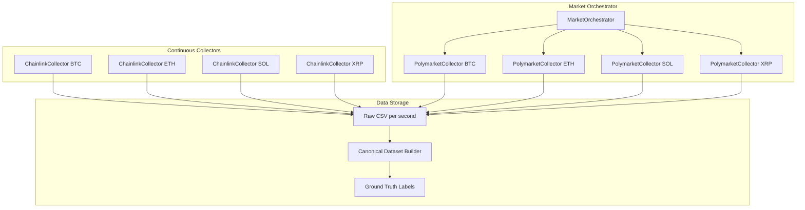
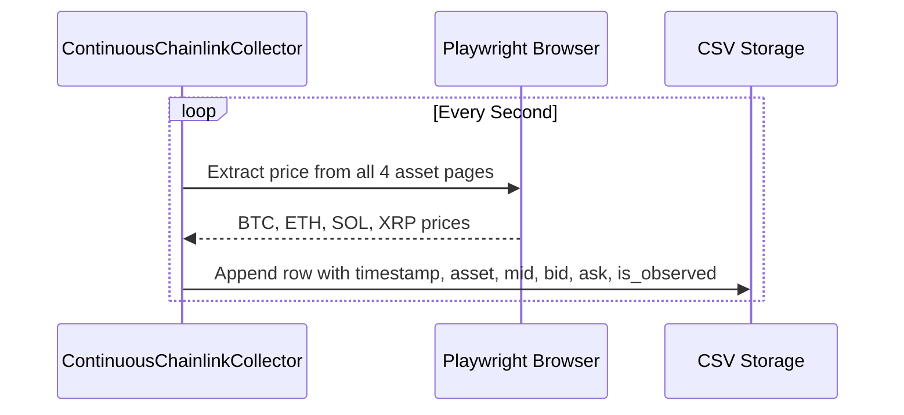
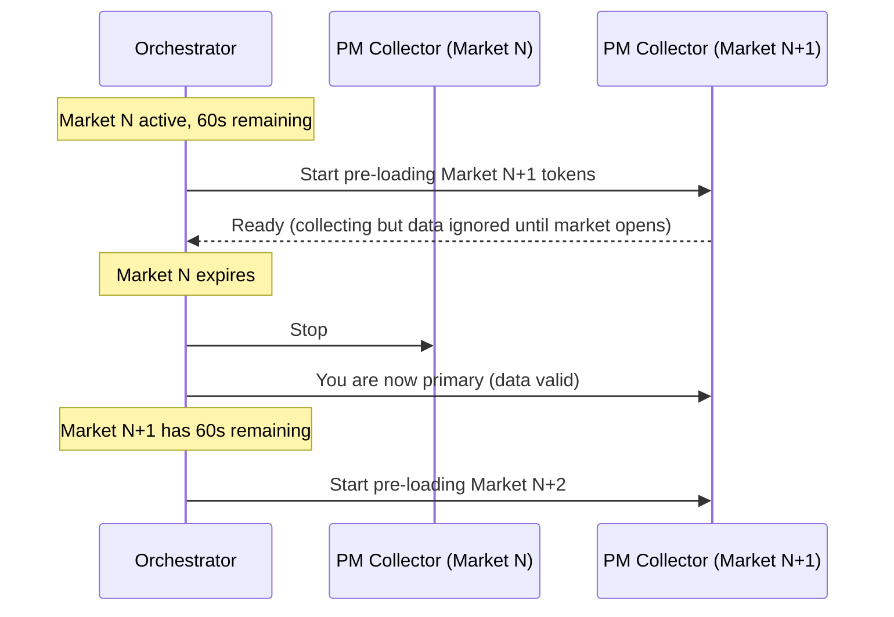

# Multi-Asset Data Collection System v2

This plan addresses the QC issues identified and scales the system to collect BTC, ETH, SOL, and XRP markets with research-grade data quality.---

## Architecture Overview



---

## Phase 1: Multi-Asset Configuration

**Goal**: Create a clean configuration system for all 4 assets.**Changes to [`config/settings.py`](config/settings.py)**:

```python
@dataclass
class AssetConfig:
    symbol: str              # "BTC", "ETH", "SOL", "XRP"
    chainlink_url: str       # Chainlink data stream URL
    polymarket_slug_prefix: str  # e.g., "btc-updown-15m"
    
ASSETS = {
    "BTC": AssetConfig(
        symbol="BTC",
        chainlink_url="https://data.chain.link/streams/btc-usd-cexprice-streams",
        polymarket_slug_prefix="btc-updown-15m"
    ),
    "ETH": AssetConfig(...),
    "SOL": AssetConfig(...),
    "XRP": AssetConfig(...),
}
```

**Unit Tests**:

- Verify all URLs are accessible
- Verify slug patterns match expected format

---

## Phase 2: Continuous Chainlink Collector

**Goal**: Chainlink runs continuously (never stops), collecting at 1Hz for all assets.**New file**: `src/chainlink/continuous_collector.py`**Key Design**:

1. One browser instance, multiple pages (one per asset)
2. Collects every second, stores to CSV with microsecond timestamps
3. Never stops - runs across market boundaries
4. Explicit flags: `is_observed=True/False` for each data point



**Data Schema** (`data/raw/chainlink_continuous.csv`):

```javascript
timestamp,asset,mid,bid,ask,is_observed
2026-01-04T12:00:00.123456Z,BTC,91234.56,91233.00,91236.00,1
2026-01-04T12:00:00.234567Z,ETH,3456.78,3455.00,3458.00,1
```

**Unit Tests**:

- Test extraction for each asset URL
- Test graceful handling of missing data (mark `is_observed=0`)
- Test timestamp precision (microseconds)

---

## Phase 3: Polymarket Multi-Asset Collector with Seamless Transitions

**Goal**: Collect PM data for all assets with pre-loading to eliminate transition gaps.**Changes to [`src/polymarket/collector.py`](src/polymarket/collector.py)**:Add generalized market discovery:

```python
def find_active_market(self, asset: str) -> Optional[Dict]:
    """Find active market for any asset (BTC, ETH, SOL, XRP)."""
    slug_prefix = ASSETS[asset].polymarket_slug_prefix
    # ... same logic as find_active_btc_15min_market but parameterized
```

**New file**: `src/orchestrator.py`**Key Design - Seamless Market Transitions**:



**Pre-load Strategy**:

- 60 seconds before market end, discover next market tokens
- Start collecting next market in parallel (discard until market opens)
- When current expires, seamlessly switch primary
- Zero gap in data collection

**Data Schema** (`data/raw/polymarket_{asset}.csv`):

```javascript
timestamp,asset,market_id,up_mid,up_bid,up_ask,down_mid,down_bid,down_ask,is_observed
```

**Unit Tests**:

- Test market discovery for each asset
- Test pre-loading logic (mock time)
- Test transition (no gaps)

---

## Phase 4: Ground Truth Market Metadata

**Goal**: Create authoritative market master table matching Polymarket's exact resolution rules.**New file**: `src/ground_truth.py`**Market Master Table Schema**:

```python
@dataclass
class MarketGroundTruth:
    market_id: str           # "btc-updown-15m-1767557700"
    asset: str               # "BTC"
    start_timestamp: datetime  # Exact start (from API)
    end_timestamp: datetime    # Exact end (from API)
    strike_K: float          # "Price to beat" from Polymarket
    settlement_price: float  # CL price at settlement (computed)
    resolved_outcome: str    # "Up" or "Down" (from Polymarket)
    computed_outcome: str    # Our computation: "Up" if settlement >= K
    outcome_match: bool      # resolved == computed
```

**Strike Definition** (critical):

- K = Chainlink price at **exact market start** (t=0)
- Settlement = Chainlink price at **exact market end** (t=900)
- Outcome = "Up" if Settlement >= K, else "Down"

**Validation**:

- Compare `computed_outcome` vs `resolved_outcome` from Polymarket API
- Any mismatch indicates timestamp or K definition error
- Target: 100% match rate

**Unit Tests**:

- Test strike computation matches Polymarket
- Test settlement computation
- Test outcome matching

---

## Phase 5: Canonical Dataset Builder v2

**Goal**: Rebuild [`scripts/build_research_dataset.py`](scripts/build_research_dataset.py) with explicit missingness flags and correct coverage math.**Key Fixes**:

1. **Coverage Math Bug**: Current "both present" cannot exceed marginal coverages

- Fix: Use consistent denominator (total seconds in market)

2. **Forward-fill Flags**: Add `cl_ffill`, `pm_ffill` columns

- `cl_ffill=1` if CL value was forward-filled (not observed this second)
- `pm_ffill=1` if PM value was forward-filled

3. **Strike from Ground Truth**: Use `strike_K` from market master table, not "first observed CL price"

**Enhanced Schema**:

```javascript
t, tau, market_id, asset,
cl_mid, cl_bid, cl_ask, cl_ffill,
pm_up_mid, pm_up_bid, pm_up_ask, pm_down_mid, pm_down_bid, pm_down_ask, pm_ffill,
K, settlement, Y, delta, delta_bps,
sum_bids, sum_asks, pm_up_spread, pm_down_spread
```

**Unit Tests**:

- Test coverage calculation correctness
- Test forward-fill flag accuracy
- Test dataset invariants (sum_bids near 1, etc.)

---

## Phase 6: QC Dashboard and Validation Suite

**Goal**: Comprehensive validation before any strategy testing.**New file**: `scripts/validate_dataset.py`**Validation Checks**:

1. **Outcome Reproduction**: computed_Y == resolved_Y for all markets
2. **Coverage Sanity**: cl_coverage <= both_coverage <= max(cl, pm)
3. **Timestamp Integrity**: No gaps > 2 seconds in either stream
4. **No-Arb Sanity**: sum_bids and sum_asks within [0.95, 1.05]
5. **Strike Consistency**: K matches "price to beat" from UI (within $1)

**Output**: `data/research/VALIDATION_REPORT.md` with pass/fail for each check---

## Phase 7: Main Collection Script

**New file**: `scripts/run_collection.py`**Usage**:

```bash
# Collect all assets continuously
python scripts/run_collection.py --assets BTC,ETH,SOL,XRP --duration 3600

# Collect specific asset
python scripts/run_collection.py --assets BTC --duration 900
```

**Features**:

- CLI flags for asset selection and duration
- Graceful shutdown (Ctrl+C saves all data)
- Real-time stats logging
- Automatic market transitions

---

## File Structure

```javascript
poly/
├── config/
│   └── settings.py              # Multi-asset configuration
├── src/
│   ├── chainlink/
│   │   ├── continuous_collector.py  # NEW: Always-on CL collector
│   │   └── frontend_collector.py    # Existing (refactored)
│   ├── polymarket/
│   │   └── collector.py             # Extended for multi-asset
│   ├── orchestrator.py              # NEW: Market transition logic
│   └── ground_truth.py              # NEW: Market metadata
├── scripts/
│   ├── run_collection.py            # NEW: Main entry point
│   ├── build_research_dataset.py    # Enhanced
│   └── validate_dataset.py          # NEW: Validation suite
├── tests/
│   ├── test_chainlink_collector.py  # NEW
│   ├── test_polymarket_collector.py # NEW
│   ├── test_orchestrator.py         # NEW
│   └── test_ground_truth.py         # NEW
└── data/
    ├── raw/
    │   ├── chainlink_continuous.csv
    │   └── polymarket_{asset}.csv
    └── research/
        ├── canonical_dataset.parquet
        ├── market_master.json
        └── VALIDATION_REPORT.md
```

---

## Implementation Order

1. **Phase 1** (Config): 30 min - Foundation for everything else
2. **Phase 2** (CL Continuous): 2 hrs - Critical path for data quality
3. **Phase 3** (PM Multi-Asset): 2 hrs - Seamless transitions
4. **Phase 4** (Ground Truth): 1.5 hrs - Research-grade labels
5. **Phase 5** (Canonical Builder): 1.5 hrs - Fix QC bugs
6. **Phase 6** (Validation): 1 hr - Confidence before strategy
7. **Phase 7** (Main Script): 1 hr - User-facing entry point

**Total Estimate**: ~10 hours of focused development---

## Success Criteria

Before proceeding to strategy backtesting:

1. All 4 assets collecting at 1Hz with no gaps
2. Market transitions have zero data loss
3. 100% outcome reproduction accuracy
4. Coverage metrics mathematically consistent
5. All validation checks pass
6. Unit test coverage > 80%

---